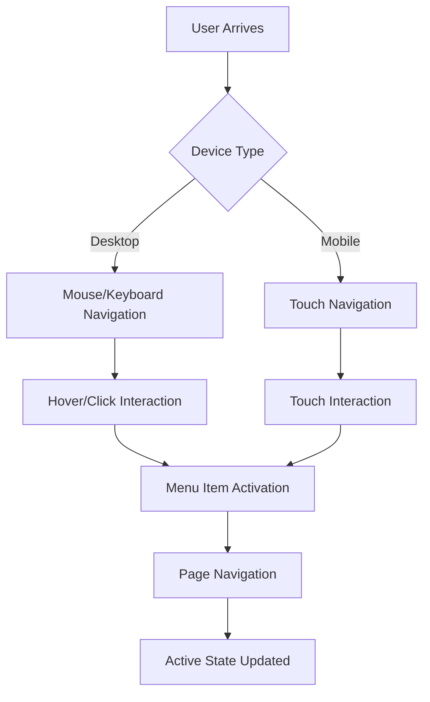

## 1. Product Overview
A comprehensive responsive navigation menu system designed to integrate seamlessly between existing media and settings sections. The menu provides intuitive navigation with full accessibility support, smooth interactions, and consistent styling across all devices and browsers.

## 2. Core Features

### 2.1 User Roles
This navigation system serves all users accessing the application interface with standardized navigation capabilities.

| Role | Access Method | Core Permissions |
|------|----------------|------------------|
| All Users | Direct interface access | Navigate through menu items, access all navigation features |

### 2.2 Feature Module
The navigation menu system consists of the following core components:

1. **Navigation Menu Component**: Responsive navigation bar with menu items, positioned between media and settings sections
2. **Interactive States System**: Hover, active, and focus states for all interactive elements
3. **Accessibility Module**: Keyboard navigation, ARIA attributes, screen reader support
4. **Transition System**: Smooth animations and state transitions
5. **Responsive Layout**: Adaptive design for desktop, tablet, and mobile breakpoints

### 2.3 Page Details

| Page Name | Module Name | Feature description |
|-----------|-------------|---------------------|
| Navigation Menu | Menu Container | Position between media and settings sections with proper spacing and visual hierarchy |
| Navigation Menu | Menu Items | Display clear navigation options with consistent typography and iconography |
| Navigation Menu | Hover States | Provide visual feedback when users hover over menu items with color changes or animations |
| Navigation Menu | Active States | Highlight currently selected/active menu item with distinct visual styling |
| Navigation Menu | Keyboard Navigation | Support Tab, Arrow keys, Enter/Space for full keyboard accessibility |
| Navigation Menu | ARIA Attributes | Include role="navigation", aria-label, aria-current for screen readers |
| Navigation Menu | Smooth Transitions | Animate hover, active, and focus state changes with CSS transitions |
| Navigation Menu | Mobile Responsive | Collapse to hamburger menu on mobile devices with touch-friendly interactions |
| Navigation Menu | Cross-browser Support | Ensure consistent functionality across Chrome, Firefox, Safari, Edge |

## 3. Core Process

Users interact with the navigation menu through multiple input methods:

**Desktop Flow**: Users can navigate using mouse hover and clicks, with visual feedback through hover states. Keyboard users can Tab through menu items and activate with Enter/Space.

**Mobile Flow**: Touch interactions trigger menu items with appropriate touch target sizes. Hamburger menu expands/collapses the navigation on smaller screens.

**Accessibility Flow**: Screen reader users receive proper context through ARIA labels and current page announcements. Keyboard navigation provides full access without mouse dependency.

## 4. User Interface Design

### 4.1 Design Style
- **Primary Colors**: Match existing UI color scheme with high contrast ratios (minimum 4.5:1)
- **Button Style**: Rounded corners (4-8px radius) with subtle shadows on hover
- **Typography**: System fonts with 16px minimum size, 1.5 line height for readability
- **Layout**: Horizontal navigation on desktop, vertical stack on mobile
- **Icons**: Consistent icon set with text labels, minimum 24px touch targets
- **Spacing**: 8px grid system with adequate white space between items

### 4.2 Page Design Overview

| Module Name | UI Elements |
|-------------|-------------|
| Menu Container | Flexbox layout, z-index management, backdrop on mobile |
| Menu Items | Consistent padding (12-16px), clear typography, icon integration |
| Hover States | Background color change (10% darker), smooth 200ms transition |
| Active States | Bold text, background highlight, left border accent |
| Focus States | Visible outline (2px solid), offset from element |
| Mobile Menu | Hamburger icon (3 lines), slide-in animation, full-height overlay |

### 4.3 Responsiveness
- **Desktop-first approach**: Optimized for 1024px+ screens
- **Tablet adaptation**: Adjust spacing and font sizes for 768px-1023px
- **Mobile optimization**: Hamburger menu below 768px with touch-friendly targets
- **Touch interaction**: Minimum 44px touch targets, swipe gestures for menu dismissal

### 4.4 Accessibility Specifications
- **Keyboard Navigation**: Full Tab sequence, Arrow key navigation, Enter/Space activation
- **ARIA Implementation**: role="navigation", aria-label, aria-expanded, aria-current
- **Screen Reader Support**: Semantic HTML, descriptive labels, live regions for state changes
- **Focus Management**: Visible focus indicators, logical focus order, focus trapping in mobile menu
- **Color Contrast**: WCAG 2.1 AA compliance minimum, AAA preferred for critical elements