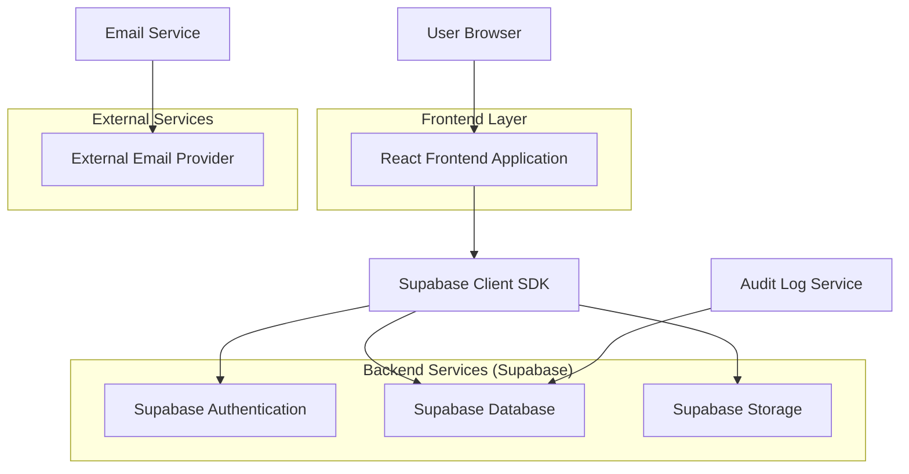
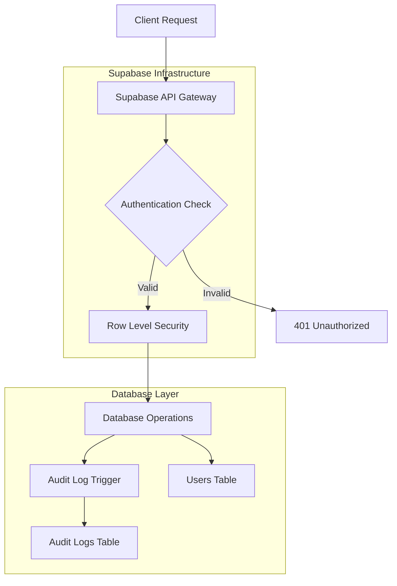
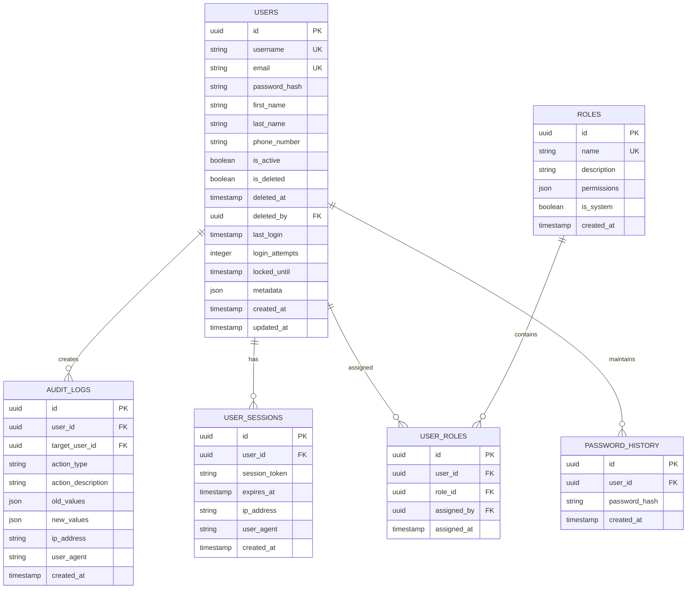

## 1. Architecture Design



## 2. Technology Description

- **Frontend**: React@18 + TypeScript + TailwindCSS@3 + Vite
- **Initialization Tool**: vite-init
- **Backend**: Supabase (BaaS)
- **Database**: PostgreSQL (via Supabase)
- **Authentication**: Supabase Auth
- **State Management**: React Context + useReducer
- **Form Validation**: React Hook Form + Zod
- **HTTP Client**: Supabase Client SDK
- **UI Components**: HeadlessUI + Heroicons
- **Date Handling**: date-fns

## 3. Route Definitions

| Route | Purpose |
|-------|---------|
| / | Login page for user authentication |
| /dashboard | Main dashboard with system overview |
| /users | User list with search and pagination |
| /users/new | User registration form |
| /users/:id | Individual user profile view |
| /users/:id/edit | User profile editing interface |
| /audit-logs | System activity audit trail |
| /profile | Current user's profile management |
| /settings | System configuration and preferences |
| /forgot-password | Password recovery interface |
| /reset-password | Password reset confirmation |

## 4. API Definitions

### 4.1 Authentication APIs

**User Login**
```
POST /auth/v1/token
```

Request:
| Param Name | Param Type | isRequired | Description |
|------------|-------------|-------------|-------------|
| email | string | true | User email address |
| password | string | true | User password |

Response:
| Param Name | Param Type | Description |
|------------|-------------|-------------|
| access_token | string | JWT access token |
| refresh_token | string | Refresh token for session renewal |
| user | object | User object with basic info |
| expires_in | number | Token expiration time in seconds |

### 4.2 User Management APIs

**Create User**
```
POST /rest/v1/users
```

Request:
| Param Name | Param Type | isRequired | Description |
|------------|-------------|-------------|-------------|
| username | string | true | Unique username |
| email | string | true | User email address |
| password | string | true | Initial password |
| first_name | string | false | User's first name |
| last_name | string | false | User's last name |
| phone_number | string | false | Contact phone number |
| role | string | true | Assigned role (admin/user) |

**Update User**
```
PATCH /rest/v1/users?id=eq.{userId}
```

Request:
| Param Name | Param Type | isRequired | Description |
|------------|-------------|-------------|-------------|
| first_name | string | false | Updated first name |
| last_name | string | false | Updated last name |
| phone_number | string | false | Updated phone number |
| role | string | false | Updated role assignment |
| is_active | boolean | false | Account status |

**Soft Delete User**
```
PATCH /rest/v1/users?id=eq.{userId}
```

Request:
| Param Name | Param Type | isRequired | Description |
|------------|-------------|-------------|-------------|
| deleted_at | timestamp | true | Deletion timestamp |
| deleted_by | uuid | true | Admin user ID who performed deletion |
| deletion_reason | string | false | Reason for deletion |

### 4.3 Audit Log APIs

**Get Audit Logs**
```
GET /rest/v1/audit_logs
```

Query Parameters:
| Param Name | Param Type | isRequired | Description |
|------------|-------------|-------------|-------------|
| user_id | uuid | false | Filter by specific user |
| action_type | string | false | Filter by action type |
| start_date | timestamp | false | Filter logs from this date |
| end_date | timestamp | false | Filter logs until this date |
| limit | number | false | Number of results (default: 50) |
| offset | number | false | Pagination offset |

## 5. Server Architecture Diagram



## 6. Data Model

### 6.1 Data Model Definition



### 6.2 Data Definition Language

**Users Table**
```sql
-- Create users table
CREATE TABLE users (
    id UUID PRIMARY KEY DEFAULT gen_random_uuid(),
    username VARCHAR(50) UNIQUE NOT NULL,
    email VARCHAR(255) UNIQUE NOT NULL,
    password_hash VARCHAR(255) NOT NULL,
    first_name VARCHAR(100),
    last_name VARCHAR(100),
    phone_number VARCHAR(20),
    is_active BOOLEAN DEFAULT true,
    is_deleted BOOLEAN DEFAULT false,
    deleted_at TIMESTAMP WITH TIME ZONE,
    deleted_by UUID REFERENCES users(id),
    last_login TIMESTAMP WITH TIME ZONE,
    login_attempts INTEGER DEFAULT 0,
    locked_until TIMESTAMP WITH TIME ZONE,
    metadata JSONB DEFAULT '{}',
    created_at TIMESTAMP WITH TIME ZONE DEFAULT NOW(),
    updated_at TIMESTAMP WITH TIME ZONE DEFAULT NOW()
);

-- Create indexes
CREATE INDEX idx_users_email ON users(email);
CREATE INDEX idx_users_username ON users(username);
CREATE INDEX idx_users_is_active ON users(is_active);
CREATE INDEX idx_users_is_deleted ON users(is_deleted);
CREATE INDEX idx_users_created_at ON users(created_at DESC);
```

**Roles Table**
```sql
-- Create roles table
CREATE TABLE roles (
    id UUID PRIMARY KEY DEFAULT gen_random_uuid(),
    name VARCHAR(50) UNIQUE NOT NULL,
    description TEXT,
    permissions JSONB DEFAULT '{}',
    is_system BOOLEAN DEFAULT false,
    created_at TIMESTAMP WITH TIME ZONE DEFAULT NOW()
);

-- Insert default roles
INSERT INTO roles (name, description, permissions, is_system) VALUES
('super_admin', 'Full system access', '{"users": ["create", "read", "update", "delete"], "roles": ["manage"], "audit": ["read"]}', true),
('admin', 'User management access', '{"users": ["create", "read", "update", "delete"], "audit": ["read"]}', true),
('user', 'Standard user access', '{"profile": ["read", "update"]}', true);
```

**Audit Logs Table**
```sql
-- Create audit logs table
CREATE TABLE audit_logs (
    id UUID PRIMARY KEY DEFAULT gen_random_uuid(),
    user_id UUID REFERENCES users(id),
    target_user_id UUID REFERENCES users(id),
    action_type VARCHAR(50) NOT NULL,
    action_description TEXT,
    old_values JSONB,
    new_values JSONB,
    ip_address INET,
    user_agent TEXT,
    created_at TIMESTAMP WITH TIME ZONE DEFAULT NOW()
);

-- Create indexes for audit logs
CREATE INDEX idx_audit_logs_user_id ON audit_logs(user_id);
CREATE INDEX idx_audit_logs_target_user_id ON audit_logs(target_user_id);
CREATE INDEX idx_audit_logs_action_type ON audit_logs(action_type);
CREATE INDEX idx_audit_logs_created_at ON audit_logs(created_at DESC);
```

**Row Level Security Policies**
```sql
-- Enable RLS on users table
ALTER TABLE users ENABLE ROW LEVEL SECURITY;

-- Allow users to read their own data
CREATE POLICY "Users can view own profile" ON users
    FOR SELECT USING (auth.uid() = id);

-- Allow admins to read all users
CREATE POLICY "Admins can view all users" ON users
    FOR SELECT USING (
        EXISTS (
            SELECT 1 FROM user_roles ur
            JOIN roles r ON ur.role_id = r.id
            WHERE ur.user_id = auth.uid() 
            AND r.name IN ('admin', 'super_admin')
        )
    );

-- Allow admins to update users
CREATE POLICY "Admins can update users" ON users
    FOR UPDATE USING (
        EXISTS (
            SELECT 1 FROM user_roles ur
            JOIN roles r ON ur.role_id = r.id
            WHERE ur.user_id = auth.uid() 
            AND r.name IN ('admin', 'super_admin')
        )
    );

-- Grant permissions
GRANT SELECT ON users TO anon;
GRANT ALL PRIVILEGES ON users TO authenticated;
GRANT SELECT ON audit_logs TO authenticated;
```

**Password History Table**
```sql
-- Create password history table for security
CREATE TABLE password_history (
    id UUID PRIMARY KEY DEFAULT gen_random_uuid(),
    user_id UUID REFERENCES users(id) ON DELETE CASCADE,
    password_hash VARCHAR(255) NOT NULL,
    created_at TIMESTAMP WITH TIME ZONE DEFAULT NOW()
);

CREATE INDEX idx_password_history_user_id ON password_history(user_id);
CREATE INDEX idx_password_history_created_at ON password_history(created_at DESC);
```

### 6.3 Audit Trigger Function
```sql
-- Create audit trigger function
CREATE OR REPLACE FUNCTION log_user_changes()
RETURNS TRIGGER AS $$
BEGIN
    IF TG_OP = 'UPDATE' THEN
        INSERT INTO audit_logs (
            user_id,
            target_user_id,
            action_type,
            action_description,
            old_values,
            new_values,
            ip_address,
            user_agent
        ) VALUES (
            auth.uid(),
            NEW.id,
            'USER_UPDATE',
            'User profile updated',
            to_jsonb(OLD),
            to_jsonb(NEW),
            inet_client_addr(),
            current_setting('application.user_agent', true)
        );
        RETURN NEW;
    END IF;
    RETURN NULL;
END;
$$ LANGUAGE plpgsql;

-- Create trigger for user changes
CREATE TRIGGER trigger_log_user_changes
    AFTER UPDATE ON users
    FOR EACH ROW
    EXECUTE FUNCTION log_user_changes();
```