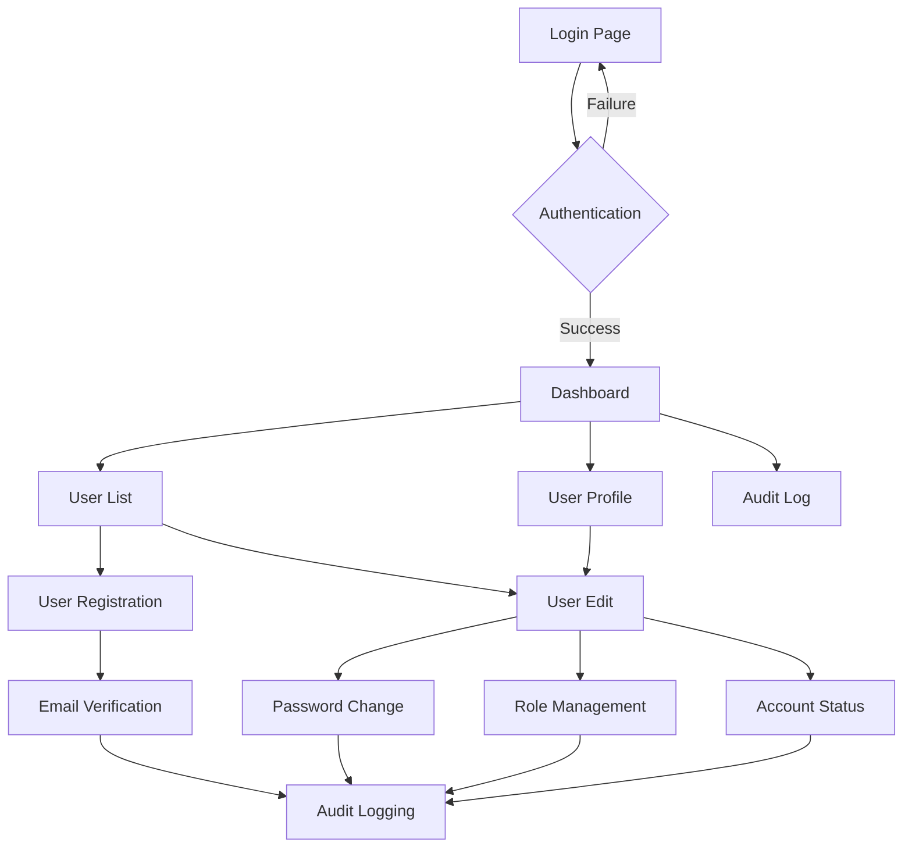

## 1. Product Overview
A comprehensive user management system that enables administrators to efficiently manage user accounts with full CRUD operations, secure authentication, and detailed audit tracking. The system provides role-based access control and ensures data security through encrypted password storage and comprehensive activity logging.

This solution addresses the need for secure, scalable user administration in enterprise applications, providing administrators with powerful tools to manage user lifecycles while maintaining compliance and security standards.

## 2. Core Features

### 2.1 User Roles
| Role | Registration Method | Core Permissions |
|------|---------------------|------------------|
| Super Admin | Manual creation by system | Full system access, user management, role assignment, audit log access |
| Admin | Invitation by Super Admin | User management within assigned scope, role assignment for standard users |
| Standard User | Self-registration with email | Profile management, basic application features |
| Guest | Anonymous access | View public content only |

### 2.2 Feature Module
The user management system consists of the following essential pages:

1. **User Dashboard**: Overview of system statistics, recent activities, quick actions
2. **User List**: Display all users with search, filter, and pagination capabilities
3. **User Profile**: Detailed user information view and management
4. **User Registration**: Form for creating new user accounts with validation
5. **User Edit**: Interface for updating user information and roles
6. **Audit Log**: Comprehensive activity tracking and reporting
7. **Login/Authentication**: Secure user authentication interface

### 2.3 Page Details
| Page Name | Module Name | Feature description |
|-----------|-------------|---------------------|
| User Dashboard | Statistics Overview | Display total users, active users, recent registrations, system health metrics |
| User Dashboard | Quick Actions | Provide shortcuts to create user, view audit logs, manage roles |
| User Dashboard | Recent Activity | Show latest user actions, account changes, login attempts |
| User List | User Table | Display paginated list with username, email, role, status, creation date |
| User List | Search & Filter | Enable search by name/email, filter by role/status/date range |
| User List | Bulk Operations | Allow selection of multiple users for batch actions (delete, deactivate) |
| User Profile | User Information | Show detailed user data including personal info, account status, roles |
| User Profile | Activity History | Display user's recent actions and account changes |
| User Profile | Account Actions | Provide buttons for edit, deactivate, reset password, delete |
| User Registration | Registration Form | Collect username, email, password, first name, last name, phone number |
| User Registration | Validation System | Validate email uniqueness, password strength, required fields |
| User Registration | Role Assignment | Allow admin to assign initial roles during creation |
| User Edit | Profile Editor | Update user information with change tracking |
| User Edit | Password Management | Change password with confirmation and strength validation |
| User Edit | Role Management | Assign/remove roles with permission inheritance |
| User Edit | Status Control | Activate/deactivate accounts with reason logging |
| Audit Log | Activity Timeline | Chronological display of all system activities |
| Audit Log | Filter & Search | Filter by user, action type, date range, severity level |
| Audit Log | Export Functionality | Export audit data to CSV/PDF formats |
| Login/Authentication | Login Form | Username/email and password input with remember me option |
| Login/Authentication | Password Recovery | Forgot password functionality with email verification |
| Login/Authentication | Session Management | Handle user sessions with timeout and security features |

## 3. Core Process

### Admin User Flow
Administrators begin at the Dashboard where they can view system statistics and recent activities. From the dashboard, they navigate to the User List to browse all users, using search and filter capabilities to find specific accounts. Clicking on a user opens the User Profile for detailed information and management options. Admins can create new users through the Registration page or modify existing users via the Edit interface. All actions are automatically logged in the Audit Log for compliance tracking.

### Standard User Flow
Standard users access the system through the Login page. Upon successful authentication, they land on a simplified dashboard showing their profile information and recent activities. They can view and edit their own profile through the Profile page, update personal information, and change their password. Standard users cannot access the full User List or perform administrative actions on other accounts.

### System Security Flow
All user actions require proper authentication. The system validates user sessions on each request and checks permissions based on assigned roles. Password changes trigger email notifications, account deactivations require admin approval, and all critical operations are logged with user identification and timestamps. Failed login attempts are tracked and may trigger account lockout policies.

## 4. User Interface Design

### 4.1 Design Style
- **Primary Color**: #2563eb (Professional blue for primary actions and headers)
- **Secondary Color**: #64748b (Neutral gray for secondary elements)
- **Success Color**: #10b981 (Green for positive actions and confirmations)
- **Error Color**: #ef4444 (Red for errors and destructive actions)
- **Button Style**: Rounded corners (8px radius) with subtle shadows on hover
- **Font Family**: Inter for headings, system-ui for body text
- **Font Sizes**: 14px for body, 16px for buttons, 24px for page titles
- **Layout Style**: Card-based design with consistent spacing (16px grid system)
- **Icons**: Heroicons for consistent iconography throughout the interface

### 4.2 Page Design Overview
| Page Name | Module Name | UI Elements |
|-----------|-------------|-------------|
| User Dashboard | Statistics Cards | Clean white cards with blue accent borders, displaying metrics with large numbers and trend indicators |
| User Dashboard | Activity Feed | Scrollable timeline with user avatars, action descriptions, and timestamps in relative format |
| User List | Data Table | Striped rows, hover effects, sortable columns with arrow indicators, action buttons with icon+text |
| User List | Search Bar | Prominent search input with filter dropdowns, positioned above the data table |
| User Profile | Profile Header | Large user avatar, name in bold 24px font, role badges with color coding |
| User Profile | Information Cards | Organized in collapsible sections with edit icons, consistent field labeling |
| User Registration | Form Layout | Two-column form on desktop, single column on mobile, clear section headers |
| User Edit | Tab Navigation | Horizontal tabs for different sections (Basic Info, Security, Roles, Activity) |
| Audit Log | Log Entries | Color-coded severity levels, expandable details, user links, monospace for technical data |
| Login/Authentication | Login Card | Centered card with company logo, social login options, clear error messaging |

### 4.3 Responsiveness
The system adopts a desktop-first approach with full mobile adaptation. The interface scales gracefully from 1920px desktop displays down to 320px mobile screens. Touch interactions are optimized with appropriately sized tap targets (minimum 44px), swipe gestures for navigation, and mobile-specific UI patterns. Tables transform into card-based layouts on mobile, and complex forms use progressive disclosure to maintain usability on smaller screens.

### 4.4 Accessibility
All interactive elements include proper ARIA labels, keyboard navigation is fully supported with visible focus indicators, and color contrast meets WCAG 2.1 AA standards. Forms provide clear error messages and validation feedback, while loading states are communicated through both visual and textual indicators.